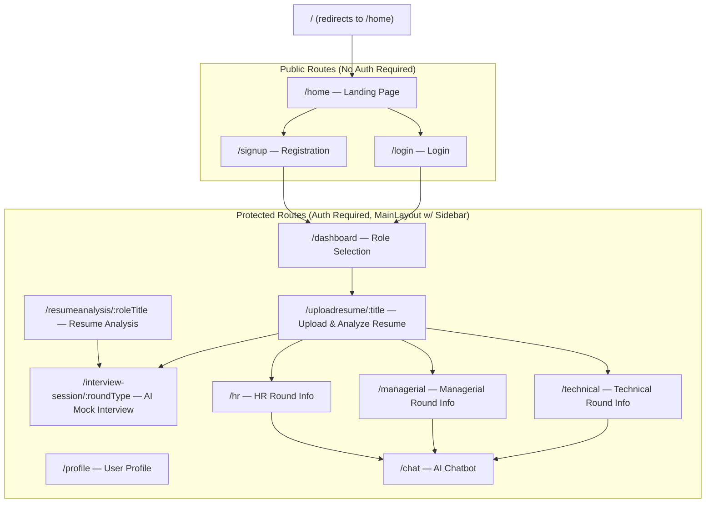

# InterviewSathi (Interview Companion) — Complete Project Description

## 1. Project Aim

**InterviewSathi** (also branded as "Interview Companion" in the UI) is a **full-stack AI-powered mock interview preparation platform** built on the **MERN stack** (MongoDB, Express.js, React, Node.js).

**Core goal:** Help users prepare for job interviews by:
1. **Selecting a target job role** (Frontend Engineer, Backend Engineer, etc.)
2. **Uploading their resume** (PDF/DOCX) for AI-powered analysis
3. **Getting AI-generated resume insights** — match score, missing keywords, suggestions
4. **Taking a live AI mock interview** — AI generates role-specific questions (Technical, Managerial, HR rounds), the user types answers, and the AI provides instant feedback
5. **Free-form AI chat** — a general chatbot for career-related questions

---

## 2. Tech Stack

| Layer | Technology |
|---|---|
| **Frontend** | React 19 + Vite 7, React Router v7, Framer Motion, TailwindCSS 3, Lucide Icons |
| **Backend** | Node.js + Express 5, Mongoose (MongoDB ODM) |
| **Database** | MongoDB (via `MONGO_URI` in `.env`) |
| **AI Provider** | Groq Cloud API (using `llama-3.1-8b-instant` model via OpenAI-compatible SDK) |
| **Authentication** | JWT (jsonwebtoken) + bcryptjs password hashing |
| **File Parsing** | pdf-parse (server-side), pdfjs-dist (client-side) |
| **PDF Generation** | jsPDF (client-side report download) |
| **Background Effects** | Custom WebGL/Three.js animated shader background |
| **Other** | Multer (file uploads), Axios (HTTP client), Recharts (charts — placeholder) |

---

## 3. Directory Structure & File-by-File Description

### Root Level (`InterviewSathi/`)

| File | Purpose |
|---|---|
| `package.json` | Root-level npm config (name: `ai-interview-bot`). Currently unused for scripts — client and server have their own. |
| `.gitignore` | Git ignore rules for the project |
| `README.md` | Placeholder readme (18 bytes) |

---

### Client (`client/`) — React Frontend

| File | Purpose |
|---|---|
| `package.json` | Frontend dependencies — React 19, Vite, TailwindCSS, Framer Motion, pdfjs-dist, jsPDF, etc. |
| `.env` | Contains `VITE_API_URL` pointing to the backend (default `http://localhost:5000`) |
| `index.html` | Vite entry HTML, mounts `#root` div |
| `vite.config.js` | Vite configuration with React plugin, `@` path alias for `src/` |
| `tailwind.config.js` | TailwindCSS configuration with custom theme extensions |
| `postcss.config.js` | PostCSS config for Tailwind |
| `jsconfig.json` | JavaScript path aliases (`@` → `src/`) |
| `eslint.config.js` | ESLint configuration |
| `components.json` | shadcn/ui component configuration (aliasPrefix, style, etc.) |

---

#### `client/src/` — Source Code

| File | Purpose |
|---|---|
| [main.jsx](file:///c:/Users/Sravan%20Karapakula/OneDrive/Desktop/New%20Folder/InterviewSathi/client/src/main.jsx) | **App entry point**. Wraps `<App />` in `<BrowserRouter>`, imports global CSS. |
| [App.jsx](file:///c:/Users/Sravan%20Karapakula/OneDrive/Desktop/New%20Folder/InterviewSathi/client/src/App.jsx) | **Routing hub**. Defines all frontend routes (see Routing section below). Uses `AnimatePresence` for page transitions. |
| [App.css](file:///c:/Users/Sravan%20Karapakula/OneDrive/Desktop/New%20Folder/InterviewSathi/client/src/App.css) | Minimal app-level CSS overrides |
| [index.css](file:///c:/Users/Sravan%20Karapakula/OneDrive/Desktop/New%20Folder/InterviewSathi/client/src/index.css) | Global CSS — TailwindCSS directives, custom scrollbar styles, base layer overrides |
| [firebase.js](file:///c:/Users/Sravan%20Karapakula/OneDrive/Desktop/New%20Folder/InterviewSathi/client/src/firebase.js) | **Stub file** — placeholder social auth functions (Google, Facebook, Apple) that just open login pages in new tabs. **Not yet integrated with real Firebase/OAuth.** |

---

#### `client/src/layouts/` — Layout Components

| File | Purpose | Status |
|---|---|---|
| [MainLayout.jsx](file:///c:/Users/Sravan%20Karapakula/OneDrive/Desktop/New%20Folder/InterviewSathi/client/src/layouts/MainLayout.jsx) | **Primary layout for all protected pages**. Contains: collapsible sidebar (Dashboard, Chat, Profile, Home links), animated shader background (`AnoAI`), logout modal with confirmation, `<Outlet />` for nested routes, footer. | ✅ Fully functional |
| [AuthLayout.jsx](file:///c:/Users/Sravan%20Karapakula/OneDrive/Desktop/New%20Folder/InterviewSathi/client/src/layouts/AuthLayout.jsx) | **Layout for auth pages** (Login/Signup). Provides gradient background wrapper. | ⚠️ Defined but **not used in current routing** — Login/Signup render as standalone pages with their own backgrounds. |

---

#### `client/src/pages/` — Page Components

| File | Route | Purpose | Status |
|---|---|---|---|
| [Home.jsx](file:///c:/Users/Sravan%20Karapakula/OneDrive/Desktop/New%20Folder/InterviewSathi/client/src/pages/Home.jsx) | `/home` | **Public landing page** — Hero section, features grid (AI Mock Interviews, Resume Analysis, Role-Specific Prep), testimonials, FAQ, footer. Has its own navbar with Login/Signup buttons. Scroll-to-top button. | ✅ Fully functional |
| [Login.jsx](file:///c:/Users/Sravan%20Karapakula/OneDrive/Desktop/New%20Folder/InterviewSathi/client/src/pages/Login.jsx) | `/login` | **Login page** — Email/password form with validation, calls `POST /api/user/login`, stores JWT token + user info in `localStorage`, redirects to `/dashboard`. Glassmorphic card on animated shader background. | ✅ Fully functional |
| [Signup.jsx](file:///c:/Users/Sravan%20Karapakula/OneDrive/Desktop/New%20Folder/InterviewSathi/client/src/pages/Signup.jsx) | `/signup` | **Registration page** — Username/email/password/confirm form, calls `POST /api/user/register`, auto-logs in after registration. Same premium design as Login. | ✅ Fully functional |
| [Dashboard.jsx](file:///c:/Users/Sravan%20Karapakula/OneDrive/Desktop/New%20Folder/InterviewSathi/client/src/pages/Dashboard.jsx) | `/dashboard` | **Main dashboard (protected)** — Shows 6 pre-defined role cards (Frontend Engineer, Backend Engineer, Full Stack Dev, Data Scientist, DevOps, UI/UX Designer). Searchable. "Add New Role" modal. Clicking a card navigates to `/uploadresume/:title`. | ✅ Fully functional |
| [UploadResume.jsx](file:///c:/Users/Sravan%20Karapakula/OneDrive/Desktop/New%20Folder/InterviewSathi/client/src/pages/UploadResume.jsx) | `/uploadresume/:title` | **Resume upload & AI analysis page (protected)** — File picker (PDF/DOCX), uploads to `POST /api/resume/upload`, displays AI analysis (match score, AI opinion, missing keywords, suggestions). Has "Download Report" (PDF), "Change Resume", and round selection buttons (Technical/Managerial/HR — navigate to static intro pages). "Start AI Interview" button navigates to `/interview-session/technical`. | ✅ Fully functional |
| [ResumeAnalysis.jsx](file:///c:/Users/Sravan%20Karapakula/OneDrive/Desktop/New%20Folder/InterviewSathi/client/src/pages/ResumeAnalysis.jsx) | `/resumeanalysis/:roleTitle` | **Alternative resume analysis page (protected)** — Client-side-only keyword analysis (no AI call). Has round selection buttons that navigate to `/interview-session/:roundType`. | ✅ Functional (client-side analysis only) |
| [InterviewSession.jsx](file:///c:/Users/Sravan%20Karapakula/OneDrive/Desktop/New%20Folder/InterviewSathi/client/src/pages/InterviewSession.jsx) | `/interview-session/:roundType` | **THE CORE INTERVIEW PAGE (protected)** — Calls `POST /api/interview/generate` to get AI questions. Displays questions one-by-one with a progress bar. User types an answer, submits via `POST /api/interview/evaluate`, gets AI feedback. Skip/Next/Finish buttons. Color-coded by round type. | ✅ Fully functional |
| [Interview.jsx](file:///c:/Users/Sravan%20Karapakula/OneDrive/Desktop/New%20Folder/InterviewSathi/client/src/pages/Interview.jsx) | *(not routed)* | **Legacy interview page** — Combined upload + multi-round question flow on one page. Uses light theme. | ⚠️ **Not used in current routing** — imported in App.jsx but no `<Route>` renders it. Superseded by the `UploadResume → InterviewSession` flow. |
| [Profile.jsx](file:///c:/Users/Sravan%20Karapakula/OneDrive/Desktop/New%20Folder/InterviewSathi/client/src/pages/Profile.jsx) | `/profile` | **User profile page (protected)** — Shows avatar (DiceBear), name, email, editable "About Me" section, resume analysis history. Fetches from `GET /api/user/profile/:email` and `GET /api/user/history/:email`. | ⚠️ UI works but **backend endpoints for profile/history are not fully implemented** — falls back to "Guest User". |
| [TechnicalRound.jsx](file:///c:/Users/Sravan%20Karapakula/OneDrive/Desktop/New%20Folder/InterviewSathi/client/src/pages/TechnicalRound.jsx) | `/technical` | **Static info page** — Lists common technical interview topics (DSA, React, APIs, debugging). "Start Technical Practice" button navigates to `/chat`. | ✅ Functional as intro page (does NOT run AI interview itself) |
| [ManagerialRound.jsx](file:///c:/Users/Sravan%20Karapakula/OneDrive/Desktop/New%20Folder/InterviewSathi/client/src/pages/ManagerialRound.jsx) | `/managerial` | **Static info page** — Lists managerial focus areas (team management, deadlines, communication). Button navigates to `/chat`. | ✅ Functional as intro page |
| [HRRound.jsx](file:///c:/Users/Sravan%20Karapakula/OneDrive/Desktop/New%20Folder/InterviewSathi/client/src/pages/HRRound.jsx) | `/hr` | **Static info page** — Lists typical HR topics (tell me about yourself, strengths, goals). Button navigates to `/chat`. | ✅ Functional as intro page |

---

#### `client/src/components/` — Reusable Components

| File | Purpose | Status |
|---|---|---|
| [ProtectedRoute.jsx](file:///c:/Users/Sravan%20Karapakula/OneDrive/Desktop/New%20Folder/InterviewSathi/client/src/components/ProtectedRoute.jsx) | **Auth guard** — Checks for `authToken` in `localStorage`. If absent, redirects to `/login`. Wraps all protected routes. | ✅ Fully functional |
| [ChatBot.jsx](file:///c:/Users/Sravan%20Karapakula/OneDrive/Desktop/New%20Folder/InterviewSathi/client/src/components/ChatBot.jsx) | **General AI chatbot** — Full chat interface with message history, typing indicator. Calls `POST /api/chat` for each message (uses Groq/LLaMA). Independent from the interview flow. | ✅ Fully functional |
| [ChatBubble.jsx](file:///c:/Users/Sravan%20Karapakula/OneDrive/Desktop/New%20Folder/InterviewSathi/client/src/components/ChatBubble.jsx) | Reusable chat bubble component with user/bot styling. | ⚠️ Defined but **not used** — `ChatBot.jsx` renders messages inline. |
| [ScoreCard.jsx](file:///c:/Users/Sravan%20Karapakula/OneDrive/Desktop/New%20Folder/InterviewSathi/client/src/components/ScoreCard.jsx) | Displays interview feedback — score, strengths, weaknesses, improved answer. | ⚠️ Defined but **not used** in any current page. |
| [NavBar.jsx](file:///c:/Users/Sravan%20Karapakula/OneDrive/Desktop/New%20Folder/InterviewSathi/client/src/components/NavBar.jsx) | Top navigation bar (Dashboard, Interview, ChatBot links). | ⚠️ Defined but **not used** — replaced by `MainLayout.jsx` sidebar. |
| [ParticlesBg.jsx](file:///c:/Users/Sravan%20Karapakula/OneDrive/Desktop/New%20Folder/InterviewSathi/client/src/components/ParticlesBg.jsx) | Interactive particle background using `react-tsparticles`. | ⚠️ Defined but **not used** — replaced by `animated-shader-background`. |
| [AnalyticsChart.jsx](file:///c:/Users/Sravan%20Karapakula/OneDrive/Desktop/New%20Folder/InterviewSathi/client/src/components/AnalyticsChart.jsx) | Placeholder analytics chart component. | ⚠️ **Placeholder only** — shows static text "Chart displays will appear here." |

---

#### `client/src/components/ui/` — UI Primitives

| File | Purpose | Status |
|---|---|---|
| `animated-shader-background.jsx` | **WebGL/Three.js animated aurora shader background** — Used as the main visual background across Home, Login, Signup, and all protected pages. | ✅ Active & used everywhere |
| `shape-landing-hero.jsx` | Shape-based landing hero component (likely from 21st.dev). | ⚠️ Defined but **not used** in any current page. |

---

#### `client/src/services/`

| File | Purpose |
|---|---|
| [api.js](file:///c:/Users/Sravan%20Karapakula/OneDrive/Desktop/New%20Folder/InterviewSathi/client/src/services/api.js) | **API service layer** — Exports `uploadResume()`, `generateInterviewQuestions()`, `loginUser()`, `registerUser()`. All call `VITE_API_URL` (defaults to `http://localhost:5000`). |

#### `client/src/constants/`

| File | Purpose |
|---|---|
| [roleInfo.js](file:///c:/Users/Sravan%20Karapakula/OneDrive/Desktop/New%20Folder/InterviewSathi/client/src/constants/roleInfo.js) | Static data for 3 roles (Frontend Developer, Backend Developer, Data Scientist) — title, overview, key skills, topics, tips. Used by `Interview.jsx` (legacy page). |

#### `client/src/lib/`

| File | Purpose |
|---|---|
| `utils.js` | Utility function `cn()` — merges Tailwind class names using `clsx` + `tailwind-merge`. |

---

### Server (`server/`) — Express.js Backend

| File | Purpose |
|---|---|
| `package.json` | Server dependencies — Express 5, Mongoose, Groq SDK, OpenAI SDK, JWT, bcryptjs, Multer, pdf-parse |
| `.env` | Contains: `MONGO_URI`, `JWT_SECRET`, `GROQ_API_KEY`, `PORT` |

---

#### `server/src/` — Source Code

| File | Purpose |
|---|---|
| [server.js](file:///c:/Users/Sravan%20Karapakula/OneDrive/Desktop/New%20Folder/InterviewSathi/server/src/server.js) | **Main server entry** — Connects to MongoDB, sets up CORS (localhost + Vercel), creates OpenAI client pointing to Groq, mounts all route groups, includes inline `POST /api/chat` endpoint, health check at `/`, global error handler. Runs on `PORT` (default 5000). |
| [config.js](file:///c:/Users/Sravan%20Karapakula/OneDrive/Desktop/New%20Folder/InterviewSathi/server/src/config.js) | `connectDB()` — Connects to MongoDB using `MONGO_URI` from env. |

---

#### `server/src/models/`

| File | Purpose |
|---|---|
| [User.js](file:///c:/Users/Sravan%20Karapakula/OneDrive/Desktop/New%20Folder/InterviewSathi/server/src/models/User.js) | **Mongoose User model** — Fields: `name`, `email` (unique), `password`. Pre-save hook hashes password with bcrypt. Instance method `matchPassword()` for login comparison. Timestamps enabled. |

---

#### `server/src/controllers/`

| File | Endpoints Handled | Purpose |
|---|---|---|
| [userController.js](file:///c:/Users/Sravan%20Karapakula/OneDrive/Desktop/New%20Folder/InterviewSathi/server/src/controllers/userController.js) | `register`, `login`, `getProfile` | User registration (checks duplicates, saves hashed password, returns JWT + user), login (validates credentials, returns JWT + user), profile fetch (requires auth). |
| [interviewController.js](file:///c:/Users/Sravan%20Karapakula/OneDrive/Desktop/New%20Folder/InterviewSathi/server/src/controllers/interviewController.js) | `generateInterview`, `evaluateAnswer` | Calls `generateAIQuestions(role, round)` and `evaluateAIAnswer(question, answer)` from `openaiService`. |
| [resumeController.js](file:///c:/Users/Sravan%20Karapakula/OneDrive/Desktop/New%20Folder/InterviewSathi/server/src/controllers/resumeController.js) | `uploadResume` | Receives resume file via Multer, parses PDF text using `parseResume()`, sends to AI via `extractResumeInsights()`, returns match score/keywords/suggestions JSON. Cleans up uploaded file. |
| [uploadController.js](file:///c:/Users/Sravan%20Karapakula/OneDrive/Desktop/New%20Folder/InterviewSathi/server/src/controllers/uploadController.js) | `uploadResume` (legacy) | Older resume upload handler — parses PDF, extracts sections via regex (skills, experience, education, certifications). **Superseded by `resumeController.js`** but still exists. |

---

#### `server/src/routes/`

| File | Base Path | Endpoints |
|---|---|---|
| [userRoutes.js](file:///c:/Users/Sravan%20Karapakula/OneDrive/Desktop/New%20Folder/InterviewSathi/server/src/routes/userRoutes.js) | `/api/user` | `POST /register`, `POST /login`, `GET /profile` (protected) |
| [interviewRoutes.js](file:///c:/Users/Sravan%20Karapakula/OneDrive/Desktop/New%20Folder/InterviewSathi/server/src/routes/interviewRoutes.js) | `/api/interview` | `POST /generate`, `POST /evaluate` |
| [resumeRoutes.js](file:///c:/Users/Sravan%20Karapakula/OneDrive/Desktop/New%20Folder/InterviewSathi/server/src/routes/resumeRoutes.js) | `/api/resume` | `POST /upload` (with Multer middleware) |
| [uploadRoutes.js](file:///c:/Users/Sravan%20Karapakula/OneDrive/Desktop/New%20Folder/InterviewSathi/server/src/routes/uploadRoutes.js) | `/api/upload` | `POST /upload` — **Duplicate of resumeRoutes** (both point to `resumeController.js` now) |

**Inline route in server.js:**
- `POST /api/chat` — General chatbot endpoint (sends user message to Groq LLaMA, returns AI reply)
- `POST /api/testdb` — Debug endpoint to test MongoDB write
- `GET /` — Health check

---

#### `server/src/services/`

| File | Purpose |
|---|---|
| [groqService.js](file:///c:/Users/Sravan%20Karapakula/OneDrive/Desktop/New%20Folder/InterviewSathi/server/src/services/groqService.js) | Initializes and exports the Groq SDK client using `GROQ_API_KEY` from env. |
| [openaiService.js](file:///c:/Users/Sravan%20Karapakula/OneDrive/Desktop/New%20Folder/InterviewSathi/server/src/services/openaiService.js) | **Core AI service** — Exports 3 functions: `generateAIQuestions(role, round)` → 5 interview questions; `evaluateAIAnswer(question, answer)` → feedback; `extractResumeInsights(resumeText, role)` → JSON with matchScore, missingKeywords, opinion, suggestions. All use Groq's `llama-3.1-8b-instant`. |

---

#### `server/src/middleware/`

| File | Purpose |
|---|---|
| [authMiddleware.js](file:///c:/Users/Sravan%20Karapakula/OneDrive/Desktop/New%20Folder/InterviewSathi/server/src/middleware/authMiddleware.js) | `protect` middleware — Extracts Bearer token from `Authorization` header, verifies JWT, attaches `req.user` from MongoDB. |
| [errorHandler.js](file:///c:/Users/Sravan%20Karapakula/OneDrive/Desktop/New%20Folder/InterviewSathi/server/src/middleware/errorHandler.js) | Generic error handler middleware (exported but **not mounted** via `app.use()` — server.js has its own inline handler). |

---

#### `server/src/utils/`

| File | Purpose |
|---|---|
| [generateToken.js](file:///c:/Users/Sravan%20Karapakula/OneDrive/Desktop/New%20Folder/InterviewSathi/server/src/utils/generateToken.js) | `generateToken(id)` — Creates a JWT with `{ _id: id }` payload, 30-day expiry. |
| [parseResume.js](file:///c:/Users/Sravan%20Karapakula/OneDrive/Desktop/New%20Folder/InterviewSathi/server/src/utils/parseResume.js) | `parseResume(filePath)` — Reads a PDF file from disk, extracts text using `pdf-parse`. |

---

## 4. Frontend Routing Map



---

## 5. Primary User Flow

```
1. User visits /home (Landing Page)
        ↓
2. Clicks "Sign Up" → /signup → Creates account → Auto-login
   OR Clicks "Login" → /login → Enters credentials
        ↓
3. Redirected to /dashboard (Protected)
   → Sees 6 role cards (Frontend, Backend, Full Stack, Data Scientist, DevOps, UI/UX)
   → Can search roles or add custom roles
        ↓
4. Clicks a role card → /uploadresume/:roleTitle
   → Uploads resume (PDF/DOCX)
   → Backend parses PDF, sends to Groq AI for analysis
   → Displays: match score, AI opinion, missing keywords, improvement suggestions
   → Can download analysis as PDF report
        ↓
5. Clicks "Start AI Interview" → /interview-session/technical
   → AI generates 5 role-specific questions for the selected round
   → User types answers one-by-one
   → Each answer is evaluated by AI with instant feedback
   → Progress bar tracks completion
   → After all questions → returns to dashboard
```

**Alternative paths from UploadResume:**
- Click "Technical"/"Managerial"/"HR" buttons → Goes to static info pages (`/technical`, `/managerial`, `/hr`) which redirect to `/chat` for free practice.
- Sidebar "Chat" → `/chat` — General AI chatbot (separate from interview)

---

## 6. Authentication Flow

```
Registration: Client → POST /api/user/register → Server hashes password (bcrypt) → Saves to MongoDB → Returns JWT (30-day) + user object
Login:        Client → POST /api/user/login → Server verifies password (bcrypt.compare) → Returns JWT + user object
Storage:      Client stores token as "authToken" and user data as "user" in localStorage
Protection:   ProtectedRoute component checks localStorage for "authToken" → Redirects to /login if missing
Server Auth:  authMiddleware.js verifies Bearer token in Authorization header for protected API routes
Logout:       Sidebar logout button → Clears localStorage → Redirects to /login
```

---

## 7. AI Integration Details

All AI calls go through **Groq Cloud API** using the **`llama-3.1-8b-instant`** model:

| Feature | Endpoint | Prompt Strategy |
|---|---|---|
| **General Chat** | `POST /api/chat` | "You are a friendly AI assistant" + user message |
| **Question Generation** | `POST /api/interview/generate` | "Generate 5 {round} interview questions for {role}" |
| **Answer Evaluation** | `POST /api/interview/evaluate` | "Question: ... Answer: ... Give short constructive feedback" |
| **Resume Insights** | `POST /api/resume/upload` | System: "You are an expert resume evaluator. Always respond with valid JSON." + detailed prompt requesting matchScore, missingKeywords, opinion, suggestions |

---

## 8. Current Status Summary

### ✅ Fully Working Features
- Landing page with hero, features, testimonials, FAQ
- User registration and login with JWT authentication
- Protected route system with sidebar navigation
- Dashboard with 6 pre-built role cards + add custom role
- Resume upload with AI-powered analysis (Groq/LLaMA)
- PDF report download of resume analysis
- AI Mock Interview session (question generation + answer evaluation)
- General AI chatbot
- Animated shader background across all pages
- Page transition animations (Framer Motion)
- Responsive design with TailwindCSS

### ⚠️ Partially Implemented / Placeholder
- **Profile page** — UI exists, but backend endpoints (`/api/user/profile/:email`, `/api/user/history/:email`) are not implemented. Falls back gracefully.
- **Social login** (Google/Facebook/Apple) — `firebase.js` is a stub, just opens login pages in new tabs
- **AnalyticsChart** — Placeholder component, no real data visualization
- **ScoreCard** — Defined but not used anywhere
- **About, Contact, Privacy Policy** — Footer links exist on Home page but routes are not defined (will 404)

### 🗑️ Legacy / Unused Files
- `Interview.jsx` — Imported but **not routed**; superseded by UploadResume + InterviewSession
- `NavBar.jsx` — Replaced by MainLayout sidebar
- `ParticlesBg.jsx` — Replaced by animated-shader-background
- `ChatBubble.jsx` — Not used; ChatBot renders messages directly
- `AuthLayout.jsx` — Defined but not used in routing (Login/Signup have their own backgrounds)
- `uploadController.js` — Legacy controller; `resumeController.js` is the active one
- `uploadRoutes.js` — Duplicates `resumeRoutes.js` (both point to same controller now)
- `shape-landing-hero.jsx` — UI component, not used
- `errorHandler.js` — Exported but not mounted (server.js uses inline handler)
- `groqService.js` — Active but could be consolidated (server.js also creates its own OpenAI client)

---

## 9. How to Run

```bash
# Start the backend (from /server)
npm run dev          # Uses nodemon → runs src/server.js on port 5000

# Start the frontend (from /client)
npm run dev          # Uses Vite → runs on port 5173
```

**Required `.env` files:**

`server/.env`:
```
MONGO_URI=mongodb+srv://...
JWT_SECRET=your_secret_key
GROQ_API_KEY=gsk_...
PORT=5000
```

`client/.env`:
```
VITE_API_URL=http://localhost:5000
```
